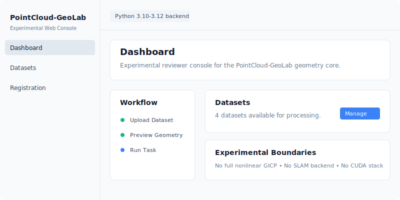

# PointCloud-GeoLab

[![Tests][tests-badge]][tests-workflow]
![Python][python-badge]
![License][license-badge]
![Coverage threshold][coverage-badge]

PointCloud-GeoLab = point-cloud geometry core + reproducible
reports/benchmarks + Experimental Web Console.

It keeps the core math visible in Python and NumPy while using SciPy,
scikit-learn, Open3D, Plotly, and PyTorch only as optional baselines or demos.

Latest release: `v1.1.0` Experimental Web Console MVP. This is a portfolio,
learning, and reviewer-oriented release that adds an experimental Web Console
on top of the stable Python API; the v0.1.0, v0.1.1, and v1.0.0 tags and
GitHub releases remain historical artifacts and should not be rewritten.
Supported Python versions are 3.10-3.12.

The goal is not to replace Open3D or PCL. The goal is to make KDTree search,
ICP, RANSAC primitive fitting, PCA/OBB, GICP-style covariance-weighted ICP, and
LiDAR segmentation understandable, runnable, and testable.

## Experimental Web Console

The repository includes an isolated experimental Web Console under `web/`.
It adds a reviewer-friendly FastAPI backend and Vue 3 frontend for uploads,
sampled previews, task runs, metrics, and artifact downloads. It is a
presentation layer over the stable Python task API, not a production web
platform or production LiDAR system.



Start the backend:

```bash
python -m pip install -e ".[dev,vis,bench]"
python -m pip install -r web/backend/requirements.txt
make web-backend
```

Start the frontend in a second shell:

```bash
make web-frontend

cd web/frontend
npm install
npm run dev
```

The backend runs at `http://127.0.0.1:8000` and the Vite frontend runs at
`http://127.0.0.1:5173`. The Web Console accepts `.ply`, `.pcd`, `.xyz`,
`.txt`, `.bin`, and `.off` uploads, samples previews to keep the browser
responsive, and stores generated Web files under ignored `outputs/web/` paths.

Verify the Web layer:

```bash
make verify-web
```

Web tasks currently execute synchronously. Long portfolio or benchmark tasks
may block until completion. The Web Console does not add full nonlinear GICP,
SLAM, CUDA, PointNet training, or an official KITTI benchmark.

More Web walkthroughs live in [docs/web_console.md](docs/web_console.md),
[docs/web_api.md](docs/web_api.md), and [web/README.md](web/README.md).

## One Command Demo

```bash
python -m pip install -e ".[dev,vis,bench]"
python examples/generate_demo_data.py --output examples/demo_data
python -m pointcloud_geolab pipeline \
  --input examples/demo_data \
  --output outputs/portfolio_demo
```

Open `outputs/portfolio_demo/report.md` or `outputs/portfolio_demo/report.html`.

Expected files:

```text
outputs/portfolio_demo/
|-- report.md
|-- report.html
|-- metrics.json
|-- figures/
|   |-- raw_pointcloud.png
|   |-- downsampled.png
|   |-- registration_before_after.png
|   |-- segmentation_result.png
|   `-- bounding_box_or_normals.png
`-- artifacts/
    |-- processed_cloud.ply
    `-- transformation.json
```

Representative portfolio-pipeline figures:


## Implementation Status

### Core-tested

- **KDTree**: nearest, kNN, radius, batch, high-dimensional, duplicate, empty,
  and boundary tests.
- **VoxelHashGrid**: radius, nearest, kNN, box query, voxel downsampling, empty
  input, and brute-force consistency tests.
- **Preprocessing**: voxel downsampling, cropping, normalization, sampling,
  outlier filtering, and local PCA normals.
- **ICP variants**: SVD, point-to-point ICP, point-to-plane ICP, robust ICP, and
  multi-scale ICP tests.
- **RANSAC primitives**: plane, sphere, cylinder, and sequential extraction
  with fixed-seed outlier tests.
- **PCA / OBB**: principal axes, degenerate geometry, and rotation-stability
  tests.
- **Segmentation**: DBSCAN, Euclidean clustering, region growing, ground
  removal, and object reports.

### Demo-ready

- **Portfolio pipeline**: one command creates Markdown and HTML reports,
  metrics, figures, PLY artifacts, and transform JSON.
- **Benchmarks**: CLI emits CSV, JSON, Markdown, PNG, parameters, seed,
  platform, repeat statistics, memory metadata, and dependency metadata.
- **KITTI-like LiDAR workflow**: user-provided single-frame `.bin` data can be
  segmented into ground and object clusters with JSON, Markdown, HTML, PLY, and
  PNG outputs. This is not an official KITTI benchmark.

### Experimental

- **GICP-style covariance-weighted ICP**: uses covariance-derived scalar weights
  and weighted SVD. This is not a full nonlinear GICP optimizer.
- **Feature registration**: ISS keypoints, local descriptors, transform RANSAC,
  and ICP refinement. Fallback diagnostics do not mean descriptor registration
  succeeded.

### Optional

- **Open3D / ML / reconstruction**: Open3D and PointNet paths are isolated from
  core tests and skip or report cleanly when unavailable.

### Documented workflow

- **Real data workflows**: Stanford Bunny, KITTI, and ModelNet instructions
  expect local files under `data/external/`. Tiny fixtures in tests validate
  formats, not real dataset accuracy. These workflows are examples plus
  verifier scripts, not stable public API entry points.

See [AUDIT.md](AUDIT.md) for the detailed truthfulness audit.

## Core Commands

Run the portfolio pipeline:

```bash
python examples/generate_demo_data.py --output examples/demo_data
python -m pointcloud_geolab pipeline \
  --input examples/demo_data \
  --output outputs/portfolio_demo
python scripts/verify_portfolio.py --quick
```

Run benchmarks and verify the output bundle:

```bash
python -m pointcloud_geolab benchmark \
  --suite all \
  --quick \
  --output outputs/benchmarks
python scripts/verify_benchmarks.py --output-dir outputs/benchmarks
```

Run the scale benchmark quick gate:

```bash
python scripts/run_scale_benchmark.py \
  --quick \
  --repeat 2 \
  --output-dir outputs/scale_benchmark
python scripts/verify_benchmarks.py \
  --output-dir outputs/scale_benchmark \
  --suite scale
```

Run real-data case studies after preparing local data:

```bash
python examples/real_bunny_registration.py \
  --data-dir data/external/stanford/bunny_pair \
  --output-dir outputs/real_bunny

python examples/kitti_lidar_segmentation.py \
  --frame data/external/kitti/velodyne/000000.bin \
  --output-dir outputs/kitti_segmentation
```

If the real data is missing, these scripts exit with preparation instructions.
Synthetic demos are smoke tests only and should not be described as real-data
results.

CI uses a dry-run version of the KITTI-like workflow:

```bash
python scripts/verify_realdata_workflow.py --dry-run
```

## Benchmark Notes

The benchmark entry point is:

```bash
python -m pointcloud_geolab benchmark \
  --suite all \
  --quick \
  --output outputs/benchmarks
```

Each suite writes CSV, JSON, Markdown, PNG, and `metrics.json`. JSON reports
include parameters, random seed, data scale, Python/platform metadata, and
optional dependency versions. Timing numbers are machine-specific, so fixed
results are not committed as claims.

Use `--repeat` when you want local timing aggregates:

```bash
python -m pointcloud_geolab benchmark \
  --suite kdtree \
  --quick \
  --repeat 3 \
  --output outputs/benchmarks/kdtree-repeat
```

For `--repeat > 1`, JSON and CSV rows include mean, standard deviation, minimum,
and maximum for timing fields. Benchmark JSON also records lightweight
`tracemalloc` peak-memory metadata as a local reference, not a portable
performance promise.

Baseline coverage:

- KDTree: brute force, optional SciPy `cKDTree`, optional sklearn `KDTree`, and
  optional Open3D KDTree.
- ICP: custom variants and optional Open3D ICP.
- RANSAC: custom primitive RANSAC, NumPy PCA plane baseline, and optional
  Open3D plane segmentation.
- GICP-style covariance-weighted ICP: compared with point-to-point ICP; not a
  full nonlinear GICP optimizer.

## Verification

Direct commands:

```bash
python -m pip install -e ".[dev,vis,bench]"
python -m compileall -q main.py pointcloud_geolab tests examples scripts benchmarks
python -m ruff check .
python -m black --check .
python -m pytest --cov=pointcloud_geolab
python scripts/check_repo_hygiene.py
python scripts/check_devcontainer.py
python scripts/check_packaging.py
python scripts/check_dataset_fixtures.py
python scripts/check_release_ready.py
python scripts/check_artifact_schema.py
python scripts/check_documented_commands.py
python scripts/verify_realdata_workflow.py --dry-run
python scripts/check_v1_ready.py
python scripts/audit_repository_state.py --help
python examples/generate_demo_data.py --output examples/demo_data
python -m pointcloud_geolab pipeline \
  --input examples/demo_data \
  --output outputs/portfolio_demo
python scripts/verify_portfolio.py --quick
python -m pointcloud_geolab benchmark \
  --suite all \
  --quick \
  --output outputs/benchmarks
python scripts/verify_benchmarks.py --output-dir outputs/benchmarks
python scripts/run_scale_benchmark.py --quick --repeat 2 --output-dir outputs/scale_benchmark
python scripts/verify_benchmarks.py --output-dir outputs/scale_benchmark --suite scale
```

Make targets:

```bash
make verify-core
make verify-portfolio
make verify-benchmarks
make verify-realdata
make verify-scale-benchmark
make verify-release-candidate
make verify-v1-candidate
make verify-full
```

`verify-core` runs compile, lint, format, tests with coverage, repository
hygiene, DevContainer, packaging, tiny dataset fixture, and artifact schema
checks, plus help checks for documented commands. CI runs `verify-core` and
`verify-portfolio`.
`verify-release-candidate` is heavier: it also regenerates portfolio and
benchmark artifacts, verifies them, and runs release-ready metadata checks.
`verify-v1-candidate` adds the real-data dry-run, scale benchmark quick gate,
Web readiness checks, and v1.1.0 readiness checks.

## Tiny Dataset Fixtures

The repository includes tiny synthetic format fixtures under
`tests/fixtures/datasets/`:

- `mini_kitti_like.bin`: four `float32 x y z intensity` records.
- `mini_modelnet_like.off`: five vertices and four triangular faces.
- `manifest.json`: expected counts and SHA256 checksums.

These fixtures prove that the readers and validators handle KITTI-like and
ModelNet-like file formats in CI. They are not real KITTI or ModelNet samples
and are not benchmark evidence. Real datasets still belong under
`data/external/`.

## Reproducible Review Environment

Reviewers can open the repository in the included DevContainer. It uses a
Python 3.12 slim image, installs `.[dev,vis,bench]`, and keeps Open3D/ML extras
and real datasets out of the default environment. Local development and CI
target Python 3.10-3.12.

Useful release-sanity commands:

```bash
python scripts/check_devcontainer.py
python scripts/check_packaging.py
python scripts/check_release_ready.py
make verify-core
make verify-portfolio
```

The v1.1.0 release notes and artifact manifest live under `docs/releases/`.
They describe expected local outputs and the remaining roadmap items without
committing generated artifacts. The v0.1.0, v0.1.1, and v1.0.0 notes remain
historical.

## Limitations

- ICP, robust ICP, multi-scale ICP, and the GICP-style implementation are local
  optimizers.
- GICP-style covariance-weighted ICP uses scalar covariance-derived weights;
  this is not a full nonlinear GICP optimizer.
- Feature registration is educational and benchmarkable, but not a replacement
  for mature descriptors in Open3D/PCL.
- Fallback output is diagnostic only. It must not be described as descriptor
  registration success.
- DBSCAN and Euclidean clustering use global radius thresholds and are sensitive
  to LiDAR density changes.
- Large LiDAR scenes need streaming/chunking and more careful memory profiling.
- v1.1.0 does not add a full nonlinear GICP optimizer, SLAM backend, CUDA
  acceleration, PointNet training release, or official real KITTI benchmark
  report.
- v1.1.0 adds an experimental Web Console, not a production web platform. Long
  Web tasks still execute synchronously and may block the request.
- The KITTI-like workflow is a user-provided single-frame case study. It is not
  an official KITTI benchmark and does not commit real KITTI data.

## Documentation

- [Algorithms](docs/algorithms.md)
- [Public API](docs/api.md)
- [Experimental Web Console](docs/web_console.md)
- [Web API](docs/web_api.md)
- [Project Boundary](docs/project_boundary.md)
- [Architecture](docs/architecture.md)
- [Testing Strategy](docs/testing_strategy.md)
- [Demo Walkthrough](docs/demo_walkthrough.md)
- [Limitations](docs/limitations.md)
- [Benchmarking](docs/benchmarking.md)
- [Datasets](docs/datasets.md)
- [Registration Case Study](docs/case_study_registration.md)
- [Stanford Bunny Case Study](docs/case_study_bunny.md)
- [KITTI LiDAR Case Study](docs/case_study_kitti.md)
- [Coverage](docs/coverage.md)
- [Artifact Schema](docs/artifact_schema.md)
- [API Stability](docs/api_stability.md)
- [CLI Reference](docs/cli_reference.md)
- [Versioning](docs/versioning.md)
- [Gallery](docs/gallery/README.md)
- [Scale Benchmark](docs/scale_benchmark.md)
- [KITTI LiDAR Result](docs/case_studies/kitti_lidar_result.md)
- [Release Checklist](docs/release_checklist.md)
- [Audit Report Template](docs/audit_report_template.md)
- [Interview Notes](docs/interview_notes.md)
- [Reviewer Checklist](docs/reviewer_checklist.md)
- [Portfolio Review Template](docs/portfolio_report_template.md)
- [Roadmap](docs/ROADMAP.md)
- [Changelog](CHANGELOG.md)
- [v0.1.1 Hardening Release](docs/releases/v0.1.1.md)
- [v1.0.0 Portfolio-Stable Release](docs/releases/v1.0.0.md)
- [v1.1.0 Experimental Web Console MVP](docs/releases/v1.1.0.md)

Historical and archived planning notes:

- [v0.1.2 Planning](docs/planning/v0.1.2.md)

## Resume Description

Built PointCloud-GeoLab, a point-cloud geometry portfolio project with custom
KDTree and VoxelHashGrid spatial indexes, ICP and GICP-style registration
variants, RANSAC primitive fitting, PCA/OBB geometry analysis, LiDAR
segmentation, fixed-seed tests, reproducible benchmarks, and documented
real-data workflows.

[tests-badge]: https://github.com/lazyJLBL/PointCloud-GeoLab/actions/workflows/tests.yml/badge.svg
[tests-workflow]: https://github.com/lazyJLBL/PointCloud-GeoLab/actions/workflows/tests.yml
[python-badge]: https://img.shields.io/badge/python-3.10--3.12-blue
[license-badge]: https://img.shields.io/badge/license-MIT-green
[coverage-badge]: https://img.shields.io/badge/coverage%20threshold-75%25-informational
