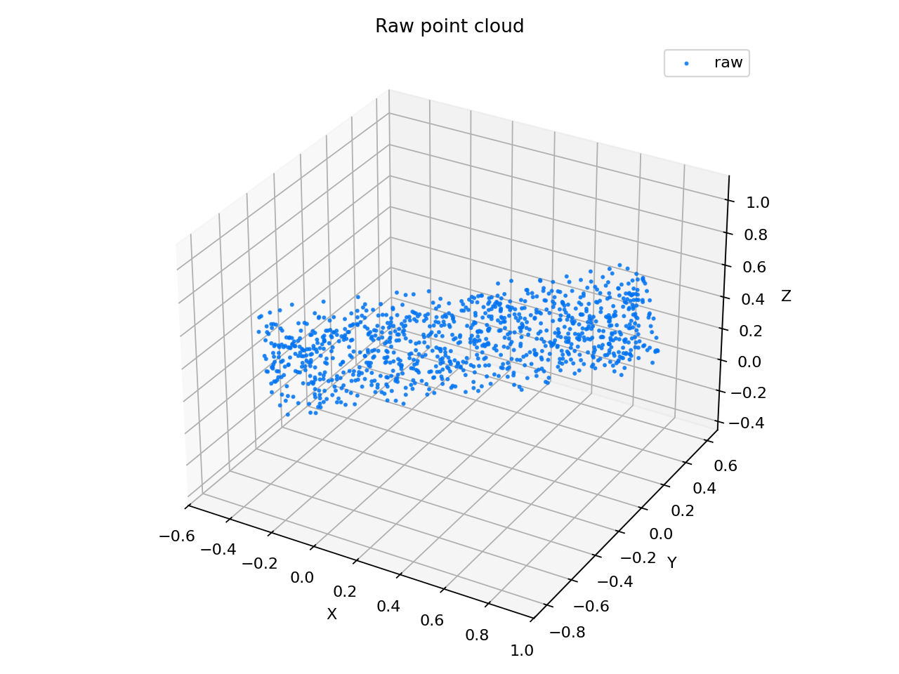
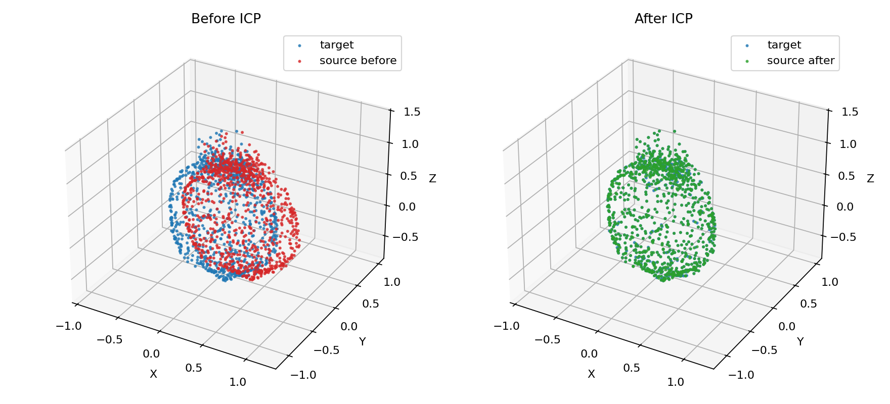
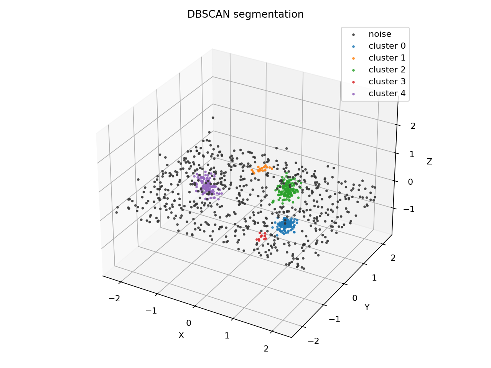
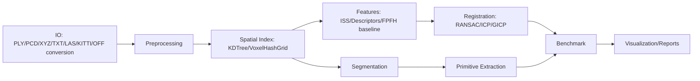

# PointCloud-GeoLab


PointCloud-GeoLab is a 3D Vision / Robotics / SLAM portfolio project focused on
from-scratch point-cloud geometry algorithms, reproducible tests, benchmarks,
visualization, and real-data workflows.

The project keeps the math visible: KDTree, ICP, RANSAC, PCA/OBB, segmentation,
ISS keypoints, local descriptors, VoxelHashGrid, and GICP are implemented in the
repo. Open3D, SciPy, and scikit-learn are used as optional baselines, IO helpers,
or visualization/reconstruction backends.

## 30 Second Highlights

- From-scratch KDTree with high-dimensional, batch, kNN, radius, and optional
  parallel queries.
- VoxelHashGrid with radius, bounded nearest-neighbor, kNN, box query, and
  downsampling support.
- Point-to-point, point-to-plane, robust Huber/Tukey/trimmed, multi-scale, and
  generalized ICP.
- ISS keypoints, custom local covariance-spectrum descriptors, descriptor
  matching, RANSAC transform estimation, and ICP refinement.
- RANSAC primitive fitting for plane, sphere, cylinder, plus sequential
  multi-model extraction.
- DBSCAN, Euclidean clustering, region growing, ground removal, and object
  cluster reports.
- Benchmarks generate CSV, JSON, Markdown, and PNG artifacts with optional
  industrial baselines.
- Real-data workflows for Stanford Bunny/Armadillo, KITTI Velodyne `.bin`, and
  ModelNet small samples without committing large datasets.

## One Command Demo

```bash
python -m pip install -e ".[dev,vis,bench]"
python examples/generate_demo_data.py --output examples/demo_data
python -m pointcloud_geolab pipeline --input examples/demo_data --output outputs/portfolio_demo
```

Open `outputs/portfolio_demo/report.md`. It is designed as the first artifact a
reviewer or interviewer should read.

## Expected Outputs

```text
outputs/portfolio_demo/
|-- report.md
|-- metrics.json
|-- figures/
|   |-- raw_pointcloud.png
|   |-- downsampled.png
|   |-- registration_before_after.png
|   |-- segmentation_result.png
|   `-- bounding_box_or_normals.png
`-- artifacts/
    |-- processed_cloud.ply
    `-- transformation.json
```

Representative figures generated from the portfolio pipeline:





The report contains project goals, input statistics, preprocessing metrics, ICP
RMSE before/after, transformation matrix, clustering results, runtime, and a
generated file index.

## Installation

```bash
python -m venv .venv
.venv\Scripts\Activate.ps1
python -m pip install -e ".[dev,vis,bench]"
```

On Linux/macOS, use the platform virtualenv activation command instead.

Optional extras:

```bash
python -m pip install -e ".[open3d]"  # Open3D baselines/reconstruction
python -m pip install -e ".[io]"      # LAS/LAZ via laspy
python -m pip install -e ".[ml]"      # optional PointNet demo
python -m pip install -e ".[all]"     # all optional groups
```

## Feature Matrix

| Area | Status | Notes |
|---|---|---|
| KDTree | Stable | Self-implemented nearest, kNN, radius, batch, high-dimensional, and optional parallel query paths. |
| VoxelHashGrid | Stable | Radius, bounded nearest-neighbor, kNN, box query, and voxel downsampling. |
| Preprocessing | Stable | Voxel downsampling, AABB crop, normalization, sampling, outlier filters, local PCA normals. |
| Registration | Stable | SVD, point-to-point ICP, point-to-plane ICP, robust ICP, multiscale ICP, and GICP. |
| Feature registration | Stable | ISS, custom descriptors, matching, RANSAC transform estimation, and ICP refinement. |
| Segmentation | Stable | DBSCAN, Euclidean clustering, region growing, ground removal, cluster reports. |
| Primitive fitting | Stable | RANSAC plane, sphere, cylinder, and sequential extraction. |
| Benchmarks | Stable | KDTree, ICP, RANSAC, registration, GICP, and segmentation suites. |
| Portfolio pipeline | Stable | One command creates Markdown report, metrics, figures, PLY artifacts, and transform JSON. |
| Real data | Documented | Stanford, KITTI, and ModelNet workflows stay outside git under `data/external/`. |
| Open3D / ML paths | Optional | Open3D and PointNet demos skip or report clear install instructions when unavailable. |

## Architecture



## Core Commands

Portfolio pipeline:

```bash
python examples/generate_demo_data.py --output examples/demo_data
python -m pointcloud_geolab pipeline --input examples/demo_data --output outputs/portfolio_demo
```

Benchmarks:

```bash
python -m pointcloud_geolab benchmark --suite all --quick --output outputs/benchmarks
```

Feature registration:

```bash
python -m pointcloud_geolab register \
  --source data/bunny_source.ply \
  --target data/bunny_target.ply \
  --method iss_descriptor_ransac_icp \
  --threshold 0.15 \
  --output outputs/registration/iss_aligned.ply
```

Primitive extraction:

```bash
python -m pointcloud_geolab extract-primitives \
  --input data/synthetic_scene.ply \
  --models plane sphere cylinder \
  --threshold 0.04 \
  --max-models 3 \
  --output outputs/primitives/scene_primitives.ply
```

Ground/object segmentation:

```bash
python -m pointcloud_geolab segment \
  --input data/lidar_scene.ply \
  --method euclidean \
  --remove-ground \
  --eps 0.18 \
  --min-points 20 \
  --export-report outputs/segmentation/cluster_report.md
```

Legacy compatibility still works:

```bash
python main.py --mode icp --source data/bunny_source.ply --target data/bunny_target.ply
```

## Benchmark Results

Run:

```bash
python -m pointcloud_geolab benchmark --suite all --quick --output outputs/benchmarks
```

Outputs include per-suite CSV/Markdown/JSON/PNG files and:

- `outputs/benchmarks/benchmark_summary.md`
- `outputs/benchmarks/benchmark_summary.json`

Core benchmark coverage:

| Suite | Self-Implemented Path | Baseline / Comparison | Output Files |
|---|---|---|---|
| KDTree | Custom KDTree and VoxelHashGrid | brute force, SciPy cKDTree, sklearn KDTree, optional Open3D KDTree | `kdtree/kdtree_benchmark.*` |
| ICP | Custom point-to-point, Huber, trimmed ICP | optional Open3D ICP | `icp/icp_benchmark.*` |
| RANSAC | Custom RANSAC primitive fitting | NumPy PCA plane, optional Open3D plane segmentation | `ransac/ransac_benchmark.*` |
| Registration | ICP and feature registration convergence | optional Open3D FPFH/RANSAC path | `registration/registration_benchmark.*` |
| GICP | Custom covariance-weighted generalized ICP | custom point-to-point ICP | `gicp/gicp_benchmark.*` |
| Segmentation | Custom Euclidean clustering | scale study over synthetic clusters | `segmentation/segmentation_benchmark.*` |

No machine-specific timing is hard-coded here. Regenerate the benchmark artifacts
locally and inspect the emitted Markdown/CSV for current numbers.

## Real Data

Large datasets are not committed. Use `docs/datasets.md` and:

```bash
python scripts/prepare_datasets.py summary
python scripts/prepare_datasets.py validate
```

Examples fail cleanly with preparation hints if data is missing:

```bash
python examples/real_bunny_registration.py --data-dir data/external/stanford/bunny_pair
python examples/kitti_lidar_segmentation.py --frame data/external/kitti/velodyne/000000.bin
python examples/modelnet_primitive_demo.py --input data/external/modelnet_small/sample.xyz
```

## Algorithm Deep Dive

- KDTree pruning: median split by axis; skip far branch when the splitting-plane
  distance cannot beat the current best.
- VoxelHashGrid: hash `floor(point / voxel_size)` and query only relevant
  buckets for locality.
- SVD rigid transform: center correspondences, compute covariance, solve
  `R = VU^T`, fix reflections, then `t = q_bar - R p_bar`.
- Point-to-plane ICP: solve the linearized residual
  `n^T((w x p) + t + p - q) = 0` with condition-number guards.
- GICP: use local covariance matrices in
  `e^T (C_q + R C_p R^T)^-1 e` to weight correspondences.
- Robust ICP: trimmed ICP keeps the closest correspondence fraction; Huber/Tukey
  kernels downweight large residuals.
- RANSAC probability: success depends on inlier ratio `w`, sample size `s`, and
  iterations `N`: `1 - (1 - w^s)^N`.
- PCA OBB: eigenvectors define local axes; extents come from min/max
  projections.
- ISS keypoints: local covariance eigenvalue ratios identify salient points;
  non-maximum suppression keeps spatial maxima.

## Tech Stack

| Layer | Tools |
|---|---|
| Core algorithms | Python, NumPy |
| Optional baselines | SciPy, scikit-learn, Open3D |
| Visualization | Matplotlib, optional Plotly |
| Testing / quality | pytest, pytest-cov, Ruff, Black, GitHub Actions |
| Data formats | PLY, PCD, XYZ/TXT, KITTI `.bin`, optional LAS/LAZ |
| Optional systems demo | C++17 / CMake KDTree demo |

## Limitations

- This is a compact geometry lab, not a replacement for Open3D, PCL, or a
  production autonomy stack.
- Demo data is intentionally small enough for CI and laptop inspection.
- ICP, robust ICP, and GICP are local optimizers and still need overlap plus a
  reasonable initial pose.
- DBSCAN and Euclidean clustering use global radii; uneven LiDAR density needs
  tuning or range-aware clustering.
- Open3D, PyTorch, Plotly, and laspy paths are optional and isolated from the
  core tests.

## Resume Description

English:

Built PointCloud-GeoLab, a point-cloud geometry portfolio project with
from-scratch KDTree and VoxelHashGrid spatial indexes, ICP/GICP registration
variants, RANSAC primitive fitting, ISS descriptor registration, segmentation,
real-data preparation workflows, CI, coverage, and reproducible benchmark/report
generation.

Chinese:

实现 PointCloud-GeoLab 点云几何作品集项目，包含自研 KDTree、VoxelHashGrid、
ICP/GICP、RANSAC primitive fitting、ISS 局部描述子配准、点云分割、真实数据准备、
CI/coverage、benchmark 和一键生成作品集报告的 pipeline。

## Optional C++ Demo

```bash
cmake -S cpp -B cpp/build
cmake --build cpp/build --config Release
```

The C++17 KDTree demo is independent from the Python package and does not affect
the Python test suite.

## Docs

- [Algorithms](docs/algorithms.md)
- [GICP](docs/GICP.md)
- [Registration](docs/registration.md)
- [Registration Case Study](docs/case_study_registration.md)
- [Datasets](docs/datasets.md)
- [Interview Notes](docs/interview_notes.md)
- [API](docs/api.md)
- [Benchmarking](docs/benchmark.md)
- [Roadmap](docs/ROADMAP.md)

## Verification

```bash
python -m compileall -q main.py pointcloud_geolab tests examples scripts benchmarks
python -m pip install -e ".[dev,vis,bench]"
python -m ruff check .
python -m black --check .
python -m pytest --cov=pointcloud_geolab
python examples/generate_demo_data.py --output examples/demo_data
python -m pointcloud_geolab pipeline --input examples/demo_data --output outputs/portfolio_demo
```

Optional:

```bash
python -m pointcloud_geolab benchmark --suite all --quick --output outputs/benchmarks
python examples/gicp_demo.py
python scripts/prepare_datasets.py summary
```
