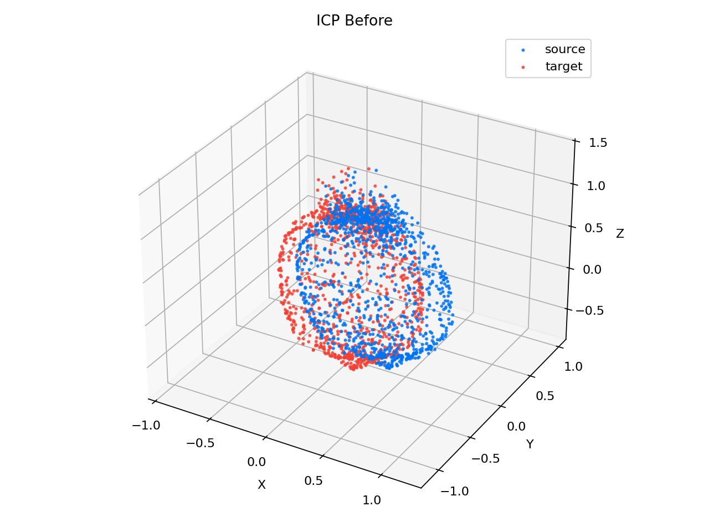
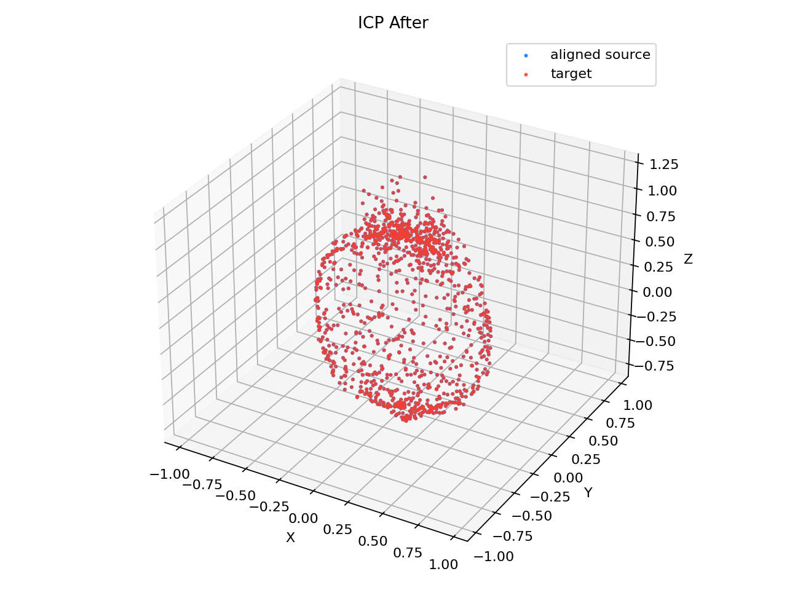
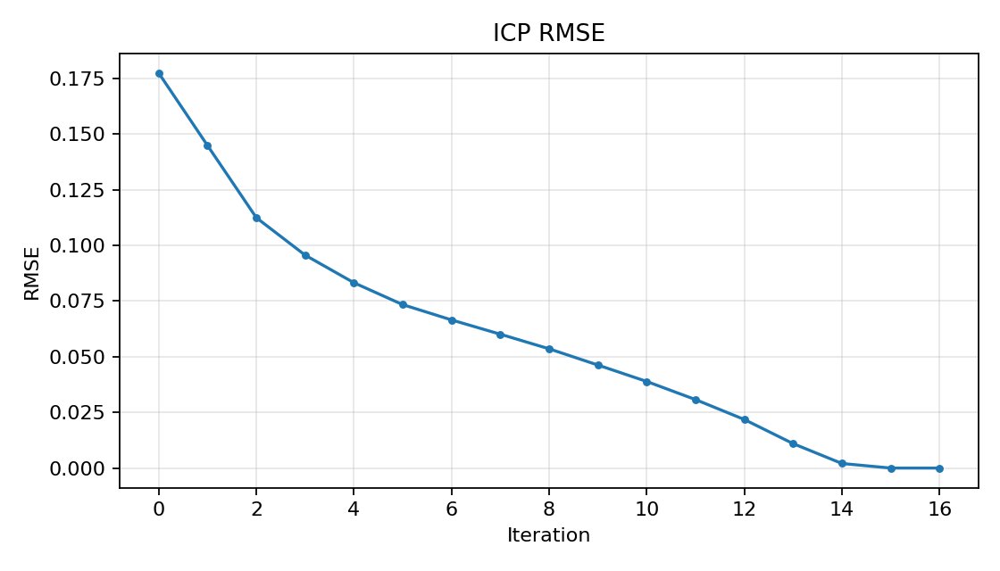
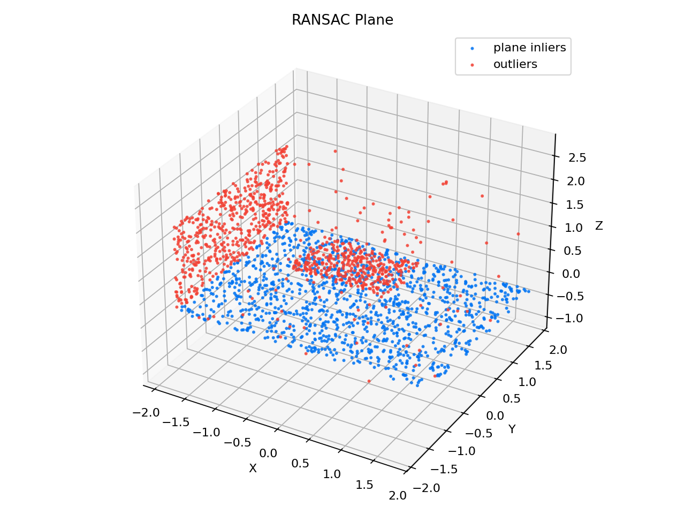
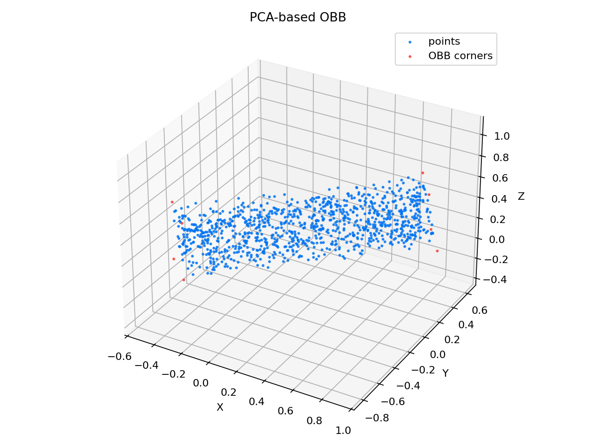
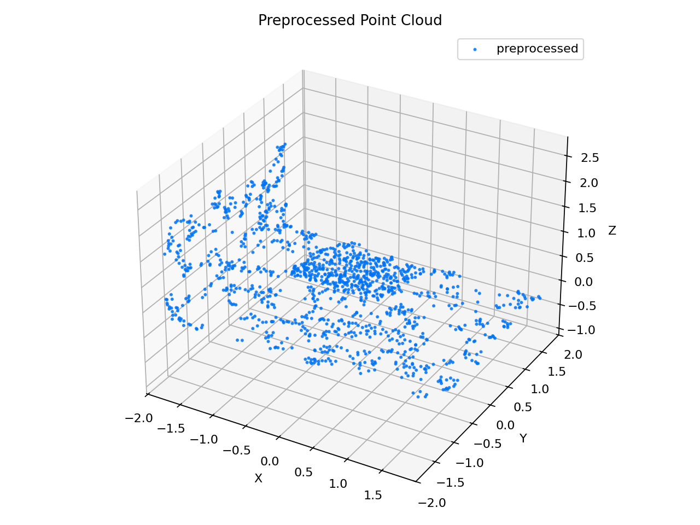

# PointCloud-GeoLab: Point Cloud Registration and 3D Geometry Lab


PointCloud-GeoLab is a Python project for point cloud registration, preprocessing,
and 3D geometry experiments. It is designed for 3D reconstruction, SLAM,
robotics perception, 3D vision practice, and interview-ready algorithm demos.

PointCloud-GeoLab 是一个点云配准与三维几何处理实验项目。核心算法以
NumPy 自实现为主，Open3D 主要用于可选的点云 I/O 和交互式可视化。

## Features

- Point cloud I/O for `.ply`, `.pcd`, and `.xyz`.
- Voxel downsampling, statistical outlier removal, radius outlier removal, and
  normal estimation.
- Custom KDTree with nearest-neighbor, KNN, and radius search.
- Point-to-point ICP using custom KDTree correspondence search and SVD rigid
  transform estimation.
- RANSAC plane fitting for robust dominant-plane extraction.
- AABB, PCA-based OBB, PCA principal direction analysis, point-to-plane
  distance, and point-to-line distance.
- Stable CLI subcommands, YAML configuration, batch manifests, JSON output,
  metrics files, examples, tests, docs, and benchmarks.

## Installation

```bash
python -m venv .venv
```

Windows PowerShell:

```powershell
.venv\Scripts\Activate.ps1
```

macOS / Linux:

```bash
source .venv/bin/activate
```

Install dependencies:

```bash
python -m pip install -r requirements.txt
python -m pip install -e .
```

Open3D is optional for the core tests because this repo includes small ASCII
fallback readers and writers. Install Open3D for interactive visualization and
broader real-world format support.

## Quick Start

Generate deterministic demo data:

```bash
python examples/generate_demo_data.py
```

Run ICP:

```bash
pointcloud-geolab icp --source data/bunny_source.ply --target data/bunny_target.ply --save-results
```

Run RANSAC plane segmentation:

```bash
pointcloud-geolab plane --input data/room.pcd --threshold 0.02 --max-iterations 1000 --save-results
```

Run geometry analysis:

```bash
pointcloud-geolab geometry --input data/object.ply --save-results
```

Run preprocessing:

```bash
pointcloud-geolab preprocess --input data/room.pcd --output results/room_clean.ply --voxel-size 0.04 --radius 0.12 --estimate-normals --save-results
```

Run a benchmark:

```bash
pointcloud-geolab benchmark kdtree --quick --save-md results/kdtree_benchmark.md
```

Run a batch manifest:

```bash
pointcloud-geolab --batch configs/batch_example.yaml --format json
```

The old interface is still supported for compatibility:

```bash
python main.py --mode icp --source data/bunny_source.ply --target data/bunny_target.ply
```

## Configuration and Outputs

Every task writes a structured `metrics.json` file under `--output-dir`
(`results/` by default). Use `--format json` when the CLI output should be
machine-readable.

YAML config values are loaded with `--config`, and CLI arguments override config
values:

```bash
pointcloud-geolab icp --config configs/icp_config.yaml --max-iterations 100
```

Batch manifests contain a `jobs` list:

```yaml
jobs:
  - name: geometry_demo
    task: geometry
    input: data/object.ply
  - name: kdtree_benchmark
    task: benchmark
    benchmark: kdtree
    quick: true
```

## Python API

```python
from pointcloud_geolab.api import run_icp

result = run_icp(
    "data/bunny_source.ply",
    "data/bunny_target.ply",
    output_dir="results/icp_api",
    max_iterations=60,
)

print(result.success)
print(result.metrics["final_rmse"])
print(result.artifacts["metrics_json"])
```

The API returns a JSON-friendly result envelope with `success`, `metrics`,
`artifacts`, `parameters`, `data`, and `error` fields.

## Results

### ICP Registration

Before:



After:



RMSE Curve:



### RANSAC Plane Fitting



### PCA-based OBB



### Preprocessing



## Development

Run the test suite:

```bash
python -m pytest
```

Run demo scripts:

```bash
python examples/demo_kdtree.py
python examples/demo_icp.py
python examples/demo_ransac_plane.py
python examples/demo_bounding_box.py
python examples/demo_preprocessing.py
```

See [docs/ROADMAP.md](docs/ROADMAP.md) for the staged project roadmap.
