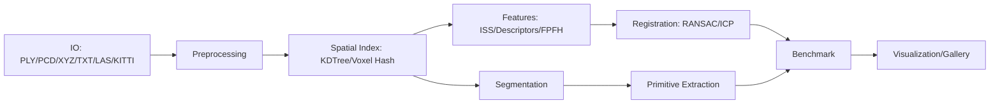

# PointCloud-GeoLab


Geometry-first point cloud lab for registration, spatial indexing, robust model
fitting, segmentation, benchmarking, and visualization.

This repository is designed as a 3D Vision / SLAM / Robotics / Geometry
Processing portfolio project. It keeps the math visible, implements core
geometry algorithms directly, and uses Open3D only where it is the right
industrial baseline or visualization/reconstruction backend.

## 30 Second Highlights

- From-scratch KDTree with high-dimensional, batch, kNN, radius, and optional parallel queries.
- Voxel Hash Grid for fixed-radius neighborhood search and box queries.
- Point-to-point, point-to-plane, robust, and multi-scale ICP.
- FPFH + RANSAC + ICP global registration baseline using Open3D FPFH.
- Self-implemented ISS keypoints + local geometric descriptors + feature RANSAC.
- RANSAC primitive fitting for plane, sphere, cylinder, plus sequential multi-model extraction.
- DBSCAN, Euclidean clustering, region growing, ground removal, and object clustering.
- Reproducible benchmark and gallery builders.
- Optional PointNet demo that skips cleanly when PyTorch is not installed.

## Architecture



## Installation

```bash
python -m venv .venv
.venv\Scripts\Activate.ps1
python -m pip install -e ".[dev,vis,bench]"
```

Optional extras:

```bash
python -m pip install -e ".[open3d]"  # Open3D-backed registration/reconstruction
python -m pip install -e ".[io]"  # LAS/LAZ
python -m pip install -e ".[ml]"  # optional PointNet
python -m pip install -e ".[all]"  # all optional groups
```

## Quick Start

```bash
python examples/generate_demo_data.py
python examples/gallery_demo.py
python scripts/verify_portfolio.py --quick
```

Core CLI examples:

```bash
python -m pointcloud_geolab benchmark --suite kdtree --quick --output outputs/benchmarks

python -m pointcloud_geolab register --source data/bunny_source.ply --target data/bunny_target.ply --method fpfh_ransac_icp --icp-method point_to_point --multiscale --voxel-sizes 0.2 0.1 0.05 --save-diagnostics outputs/registration/diagnostics.json --output outputs/registration/aligned.ply

python -m pointcloud_geolab register --source data/bunny_source.ply --target data/bunny_target.ply --method iss_descriptor_ransac_icp --threshold 0.15 --output outputs/registration/iss_aligned.ply

python -m pointcloud_geolab extract-primitives --input data/synthetic_scene.ply --models plane sphere cylinder --threshold 0.04 --max-models 3 --output outputs/primitives/scene_primitives.ply --export-html outputs/primitives/scene_primitives.html

python -m pointcloud_geolab segment --input data/lidar_scene.ply --method euclidean --remove-ground --ground-axis z --ground-angle-threshold 20 --eps 0.18 --min-points 20 --output outputs/segmentation/object_clusters.ply --export-html outputs/segmentation/object_clusters.html --export-report outputs/segmentation/cluster_report.md

python -m pointcloud_geolab reconstruct --input data/object.ply --method poisson --output outputs/reconstruction/object_mesh.ply
```

Legacy compatibility still works:

```bash
python main.py --mode icp --source data/bunny_source.ply --target data/bunny_target.ply
```

## Python API

```python
from pointcloud_geolab.api import (
    run_extract_primitives,
    run_feature_registration,
    run_ground_object_segmentation,
    run_multiscale_icp,
    run_robust_icp,
)

registration = run_feature_registration("data/bunny_source.ply", "data/bunny_target.ply")
objects = run_ground_object_segmentation("data/lidar_scene.ply")
primitives = run_extract_primitives("data/synthetic_scene.ply")

print(registration.metrics)
print(objects.data["clusters"])
print(primitives.data["primitives"])
```

All high-level APIs return a JSON-friendly `TaskResult` with `success`,
`metrics`, `artifacts`, `parameters`, `data`, and `error`.

## Gallery

Run:

```bash
python examples/gallery_demo.py
```

Generated assets:

- `outputs/gallery/registration_before_after.png`
- `outputs/gallery/multiscale_icp_curve.png`
- `outputs/gallery/robust_icp_outlier_comparison.png`
- `outputs/gallery/primitive_extraction_scene.html`
- `outputs/gallery/segmentation_ground_objects.html`
- `outputs/gallery/kdtree_benchmark.png`
- `outputs/gallery/ransac_outlier_benchmark.png`
- `outputs/gallery/README_gallery.md`

## Benchmark Results

Run:

```bash
python -m pointcloud_geolab benchmark --suite all --quick --output outputs/benchmarks
```

Outputs include per-suite CSV/Markdown/JSON/PNG files and:

- `outputs/benchmarks/benchmark_summary.md`
- `outputs/benchmarks/benchmark_summary.json`

Expected conclusions:

| Suite | What It Shows |
|---|---|
| KDTree | Custom pruning is correct and educational; SciPy/sklearn are optimized baselines. |
| ICP | Plain ICP is accurate near the solution but sensitive to outliers and initialization. |
| RANSAC | Robust fitting survives moderate outlier ratios until clean samples are unlikely. |
| Registration | Coarse feature registration expands ICP's convergence basin. |
| Segmentation | Clustering runtime is dominated by radius-neighborhood queries. |

No benchmark numbers are hard-coded in the README. Regenerate them locally.

## Algorithm Deep Dive

- KDTree pruning: recursively split by median; skip the far branch when the splitting-plane distance exceeds the current best distance.
- SVD rigid transform: center correspondences, compute covariance, solve `R = VU^T`, fix reflections, then `t = q_bar - R p_bar`.
- Point-to-plane ICP: solve the linearized residual `n^T((w x p) + t + p - q) = 0` with condition-number guards.
- Robust ICP: trimmed ICP keeps the closest correspondence fraction; Huber/Tukey kernels downweight large residuals.
- RANSAC probability: success depends on inlier ratio `w`, sample size `s`, and iterations `N`: `1 - (1 - w^s)^N`.
- PCA OBB: eigenvectors define local axes; extents come from min/max projections.
- ISS keypoints: local covariance eigenvalue ratios identify points with strong 3D saliency; NMS keeps spatial maxima.
- Euclidean clustering: connected components are built from radius-neighborhood graph queries.

## What This Project Demonstrates

- Computational geometry: KDTree, voxel hashing, PCA/OBB, primitive residuals.
- Numerical optimization: SVD alignment, point-to-plane linearization, ICP convergence diagnostics.
- Robust estimation: RANSAC, trimmed ICP, Huber/Tukey kernels, model selection.
- Spatial data structures: batch KDTree and voxel hash neighborhood search.
- Reproducible engineering: deterministic synthetic data, tests, benchmarks, gallery, CI.
- Visualization and analysis: Plotly HTML, Matplotlib projections, benchmark reports.

## Docs

- [Algorithms](docs/algorithms.md)
- [Registration](docs/registration.md)
- [Reconstruction](docs/reconstruction.md)
- [Interview Notes](docs/interview_notes.md)
- [API](docs/api.md)
- [Benchmarking](docs/benchmark.md)

## Verification

```bash
python -m pytest
python -m pytest --cov=pointcloud_geolab
python -m ruff check .
python -m black --check .
python examples/generate_demo_data.py
python examples/gallery_demo.py
python scripts/verify_portfolio.py --quick
python -m pointcloud_geolab benchmark --suite all --quick --output outputs/benchmarks
```

Optional dependencies are isolated: PyTorch, laspy, Plotly, and Open3D-dependent
paths either skip in tests or return a clear install message instead of breaking
core geometry functionality.
