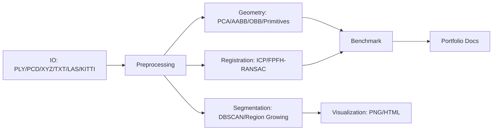

# PointCloud-GeoLab


PointCloud-GeoLab is a geometry-first point cloud processing lab featuring
from-scratch implementations of classic computational geometry algorithms,
robust registration, primitive fitting, segmentation, benchmarking, and
interactive visualization.

This project is built as a 3D Vision / Robotics / Geometry Processing portfolio
project: it keeps the math visible, produces reproducible outputs, and compares
custom implementations against standard libraries where useful.

## Technical Highlights

- From-scratch KDTree, point-to-point ICP, RANSAC plane fitting, PCA, AABB, and OBB.
- Feature-based global registration: `Downsample -> Normal Estimation -> FPFH -> RANSAC -> ICP`.
- Robust primitive fitting for planes, spheres, and cylinders with a generic RANSAC framework.
- DBSCAN, Euclidean clustering, and normal-aware region growing segmentation.
- Real point cloud I/O: PLY, PCD, XYZ/TXT, KITTI `.bin`, and optional LAS/LAZ via `laspy`.
- Benchmark system for KDTree, ICP, RANSAC, and global registration with CSV, Markdown, JSON, and PNG outputs.
- Plotly HTML export for registration, segmentation, and inlier/outlier inspection.
- Optional PointNet demo on synthetic shapes without affecting the lightweight geometry install.

## Architecture



## Installation

```bash
python -m venv .venv
.venv\Scripts\Activate.ps1  # Windows PowerShell
python -m pip install -e .
```

Optional extras:

```bash
python -m pip install -e ".[dev,vis,io,bench]"
python -m pip install -e ".[ml]"  # optional PyTorch PointNet demo
```

## Quick Start

Generate deterministic demo data:

```bash
python examples/generate_demo_data.py
```

Run the main portfolio commands:

```bash
python -m pointcloud_geolab preprocess --input data/room.pcd --output outputs/preprocessing/cleaned.ply --voxel-size 0.05 --estimate-normals

python -m pointcloud_geolab register --source data/bunny_source.ply --target data/bunny_target.ply --method fpfh_ransac_icp --voxel-size 0.05 --output outputs/registration/aligned.ply --save-transform outputs/registration/transform.txt --save-results

python -m pointcloud_geolab fit-primitive --input data/object.ply --model sphere --threshold 0.02 --output outputs/primitives/sphere_inliers.ply

python -m pointcloud_geolab segment --input data/object.ply --method dbscan --eps 0.08 --min-points 5 --output outputs/segmentation/segmented_scene.ply

python -m pointcloud_geolab benchmark --suite all --quick --output outputs/benchmarks

python -m pointcloud_geolab visualize --input outputs/segmentation/segmented_scene.ply --mode pointcloud --output outputs/visualization/scene.html
```

The previous compatibility entrypoint still works:

```bash
python main.py --mode icp --source data/bunny_source.ply --target data/bunny_target.ply
```

## Python API

```python
from pointcloud_geolab.api import run_global_registration, run_primitive_fitting, run_segmentation

registration = run_global_registration("source.ply", "target.ply", voxel_size=0.05)
primitive = run_primitive_fitting("scene.ply", model="sphere", threshold=0.02)
segmentation = run_segmentation("scene.ply", method="dbscan", eps=0.05, min_points=20)

print(registration.metrics)
print(primitive.data["model_params"])
print(segmentation.data["clusters"])
```

All high-level APIs return a JSON-friendly `TaskResult` containing `success`,
`metrics`, `artifacts`, `parameters`, `data`, and `error`.

## Algorithm Notes

### KDTree

The custom KDTree recursively median-splits the point set and prunes subtrees
using the distance to the splitting plane. It supports nearest-neighbor, kNN,
and radius queries.

### ICP

Point-to-point ICP alternates between KDTree correspondence search and SVD rigid
transform estimation. Point-to-plane ICP uses the linearized residual
`n^T((w x p) + t + p - q) = 0`.

### FPFH + RANSAC + ICP

Global registration uses Open3D for FPFH descriptors and feature RANSAC, then
refines with the project's ICP implementation. This shows why plain ICP is
accurate near the solution but brittle under large initial rotations.

### Primitive Fitting

The generic RANSAC framework supports:

- Plane residual: `|n^T x + d|`
- Sphere residual: `abs(||x - c|| - r)`
- Cylinder residual: `abs(distance_to_axis(x) - r)`

### Segmentation

DBSCAN and Euclidean clustering use KDTree radius neighborhoods. Region growing
adds a normal-angle threshold to avoid merging geometrically different surfaces.

## Benchmarking

Quick benchmark:

```bash
python -m pointcloud_geolab benchmark --suite all --quick --output outputs/benchmarks
```

Outputs:

- `*_benchmark.csv`
- `*_benchmark.md`
- `*_benchmark.json`
- `*_benchmark.png`
- `metrics.json`

Typical conclusions:

- The custom KDTree is explainable and useful for teaching; optimized SciPy
  `cKDTree` and sklearn KDTree are expected to be faster at larger scales.
- Plain ICP can fail when the initial rotation is large; FPFH+RANSAC+ICP is more
  robust because it first estimates a coarse pose from local geometric features.
- RANSAC keeps primitive fitting stable as outlier ratios increase, until the
  probability of sampling a clean minimal set becomes too low.

## Gallery Outputs

The examples write portfolio assets under `outputs/`:

```bash
python examples/global_registration_demo.py
python examples/primitive_fitting_demo.py
python examples/segmentation_demo.py
python examples/preprocess_lidar_demo.py
python examples/benchmark_demo.py
python examples/visualization_demo.py
python examples/gallery_demo.py
```

Optional PointNet:

```bash
python examples/pointnet_demo.py
python -m pointcloud_geolab train-pointnet --epochs 1 --batch-size 8 --output outputs/ml/pointnet_model.pt
```

## Supported Formats and Preprocessing

Supported input formats:

- `.ply`, `.pcd`
- `.xyz`, `.txt`
- KITTI Velodyne `.bin`
- `.las`, `.laz` with `laspy`

Preprocessing includes voxel downsampling, statistical outlier removal, radius
outlier removal, normal estimation, normalization, AABB crop, random sampling,
and farthest point sampling.

## Tests

```bash
python -m pytest
python -m pytest --cov=pointcloud_geolab
```

Tests use synthetic point clouds and fixed random seeds. Optional PointNet tests
are skipped automatically when PyTorch is not installed.

## Docs

- [Algorithms](docs/algorithms.md)
- [Registration](docs/registration.md)
- [Benchmarking](docs/benchmark.md)
- [API](docs/api.md)
- [Interview Notes](docs/interview_notes.md)
- [Roadmap](docs/ROADMAP.md)

## Why This Project Matters

Point cloud processing is not just visualization. A strong geometry project
needs nearest-neighbor search, rigid transform optimization, robust estimation,
surface reasoning, segmentation, reproducible benchmarks, and clear engineering
interfaces. PointCloud-GeoLab demonstrates those pieces as one coherent system
instead of a collection of disconnected scripts.
