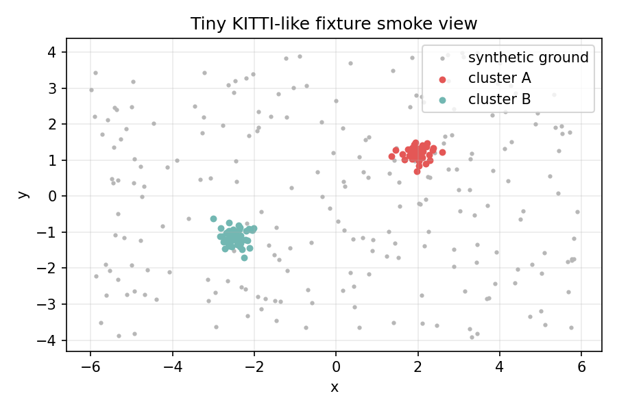

# KITTI-Like LiDAR Segmentation Result

This case study documents a user-provided KITTI-like single-frame workflow. It
does not include real KITTI data, and it is not an official KITTI benchmark.

## Command

```bash
python examples/kitti_lidar_segmentation.py \
  --frame data/external/kitti/velodyne/000000.bin \
  --output-dir outputs/kitti_segmentation
```

If the frame is missing, the script exits with a clear preparation message. CI
uses a synthetic dry-run instead:

```bash
python scripts/verify_realdata_workflow.py --dry-run
```

## Outputs

- `outputs/kitti_segmentation/report.md`
- `outputs/kitti_segmentation/report.html`
- `outputs/kitti_segmentation/metrics.json`
- `outputs/kitti_segmentation/kitti_bev.png`
- `outputs/kitti_segmentation/kitti_clusters.png`
- `outputs/kitti_segmentation/kitti_height_histogram.png`
- `outputs/kitti_segmentation/cluster_report.md`
- `outputs/kitti_segmentation/kitti_clusters.ply`

Metrics include point counts, ground and non-ground counts, cluster summaries,
timing, and `tracemalloc` memory metadata.

## Synthetic Smoke View



The image above is generated from a synthetic tiny fixture for documentation.
It is not a real KITTI frame.

## Limits

- Single-frame segmentation only.
- Fixed-radius clustering is sensitive to range and LiDAR density.
- No official KITTI benchmark split, leaderboard metric, or dataset download is
  included.
- Real data belongs under `data/external/` and should not be committed.
