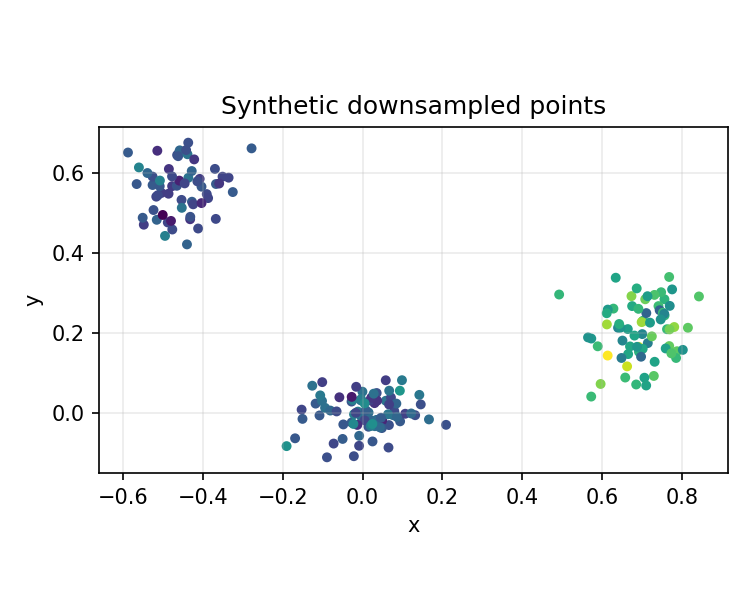
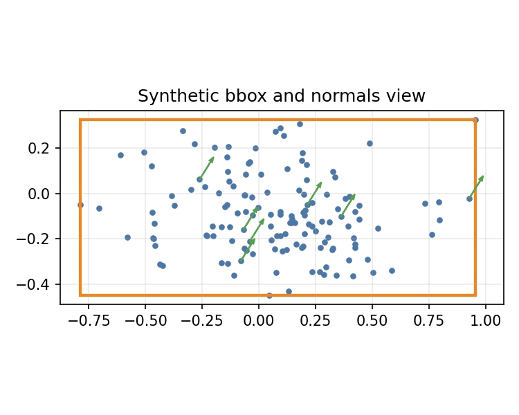
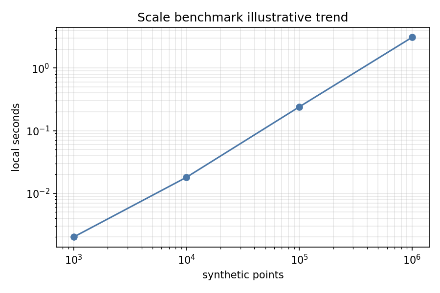

# Gallery

This gallery gives reviewers a quick map of the visual outputs that the project
can generate. Images are synthetic, tiny fixture, or user-provided workflow
examples as labeled.

## Portfolio Pipeline

Synthetic demo input from the portfolio pipeline.

Synthetic downsampled view used for documentation.

Synthetic registration before/after view from the portfolio pipeline.

Synthetic segmentation result from the portfolio pipeline.

Synthetic geometry view showing bbox and normals-style annotations.

## KITTI-Like Workflow

Tiny synthetic KITTI-like format smoke view. This is not a real KITTI frame and
not an official KITTI benchmark.

## Benchmark

Illustrative scale-benchmark trend chart. Actual timings should be regenerated
locally and treated as machine-specific.
