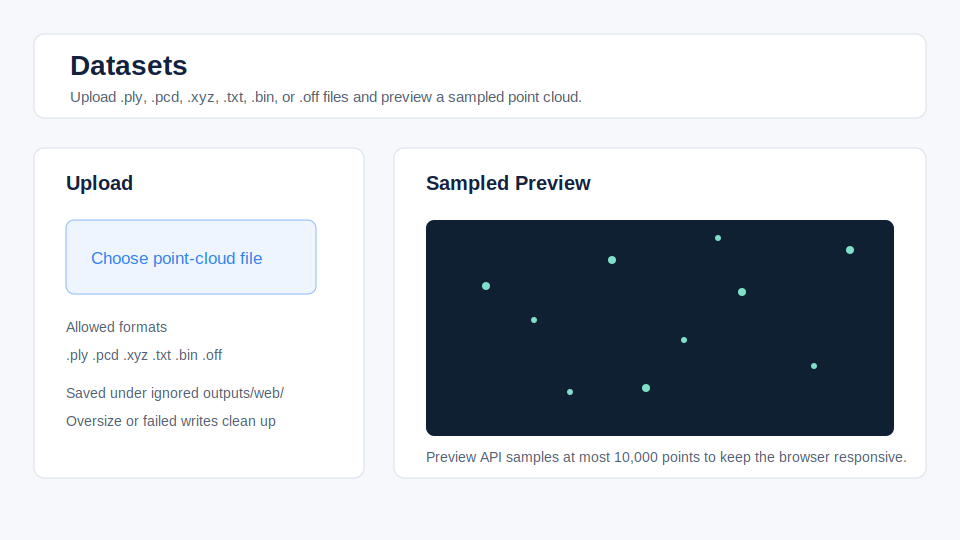
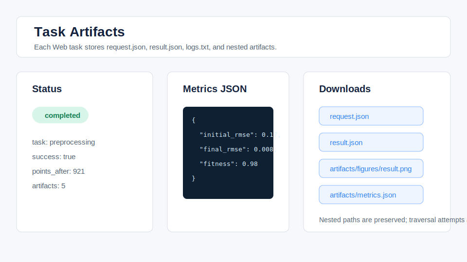

# Experimental Web Console

The Web Console is an experimental reviewer interface for PointCloud-GeoLab
v1.1.0. It is not a production LiDAR platform, not a production web platform,
and does not change the stable Python package API.

Supported backend Python versions are 3.10-3.12. Python 3.12 is recommended
for the local Web Console environment.


## Install

```bash
python -m pip install -e ".[dev,vis,bench]"
python -m pip install -r web/backend/requirements.txt
```

Frontend dependencies stay under `web/frontend` and are not part of the core
Python package install:

```bash
cd web/frontend
npm install
```

## Run

Start the backend:

```bash
make web-backend
```

Start the frontend in a separate shell:

```bash
make web-frontend
```

The frontend Vite server proxies `/api` to `http://127.0.0.1:8000`.

Verify the Web layer without running the full release gate:

```bash
make verify-web
```

On Windows without `make`, run `mingw32-make verify-web`.

## Reviewer Workflow



The intended reviewer path is:

1. Upload a tiny or local point-cloud file.
2. Preview the sampled point cloud in the browser.
3. Run a preprocessing, registration, segmentation, geometry, primitive,
   quick benchmark, or portfolio task.
4. Inspect metrics and download `request.json`, `result.json`, `logs.txt`, and
   nested files under `artifacts/`.



## Storage

Uploads are written under:

```text
outputs/web/uploads/{dataset_id}/
```

Task records are written under:

```text
outputs/web/tasks/{task_id}/
```

Each task directory contains:

- `request.json`
- `result.json`
- `logs.txt`
- `artifacts/`

These paths are generated outputs and should not be committed.

## Scope

The backend routes call stable `pointcloud_geolab.api` task functions for
processing work. The preview route uses the repository point-cloud IO reader
only to provide sampled points to the browser.

Supported upload formats are `.ply`, `.pcd`, `.xyz`, `.txt`, KITTI-like
`.bin`, and ModelNet-like `.off`. The backend rejects path-like filenames and
limits upload size.

The Web Console includes:

- dataset upload, listing, deletion, and sampled preview
- preprocessing
- ICP, robust ICP, and multiscale ICP
- segmentation and ground-object segmentation
- geometry analysis
- primitive plane, fit, and extract tasks
- quick benchmark runs
- portfolio verification
- historical task reports and artifact downloads

It does not add full nonlinear GICP, a SLAM backend, CUDA acceleration,
PointNet training pages, or an official KITTI benchmark.

Benchmark timing and memory values are local machine references only.
Tasks currently run synchronously inside the backend process. Long portfolio or
benchmark requests may block until completion.
